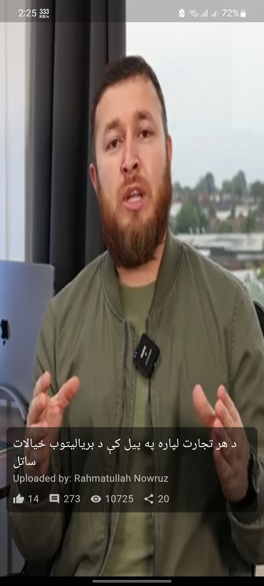

# Assignment - A Test Project 

 

This is a **test project** created as part of an assignment to demonstrate my Flutter development skills. The app fetches data from the **Ulearna API**, displays videos in a clean design, and provides video details such as likes, views, and comments. It also implements advanced features like **lazy loading**, **local caching**, and **BLoC state management**.

---

## Features

- **Fetch Data from Ulearna API**: The app retrieves video data from the Ulearna API and displays it in a user-friendly interface.
- **Clean Design**: Videos are displayed in a modern and visually appealing layout.
- **Video Details**: Each video includes additional information such as likes, views, and comments.
- **BLoC State Management**: The app uses the **BLoC (Business Logic Component)** architecture for efficient state management.
- **Lazy Loading**: Videos are loaded dynamically as the user scrolls, improving performance and reducing initial load time.
- **Local Caching**: Data is stored locally using caching mechanisms to minimize redundant API calls and improve offline functionality.

---

## Screenshots

Here are some screenshots of the app:

| Home Screen                                         | Video Details Screen                               |
|-----------------------------------------------------|----------------------------------------------------|
|   |   |
|  | [Home Screen](assets/screenshots/home_screen3.jpg) |

---

## Installation

### Prerequisites

Before you begin, ensure you have the following installed:
- [Flutter SDK](https://flutter.dev/docs/get-started/install) (version >= 3.0.0)
- [Dart SDK](https://dart.dev/get-dart) (comes bundled with Flutter)
- An IDE like [VS Code](https://code.visualstudio.com/) or [Android Studio](https://developer.android.com/studio)

### Steps to Run the App
1. Clone the Repository
   First, clone this repository to your local machine using the following command:
   ```
   git clone https://github.com/KhoshalS/assignment.git
   cd assignment
   ```
2. Install Dependencies
      Once you've cloned the repository, navigate to the project directory and install all required dependencies using the following command:
   ```flutter pub get```
   This command will download and install all the necessary packages listed in the pubspec.yaml file, such as:

`flutter_bloc` for state management.
`http` for making API calls.
`cached_network_image` for caching images locally.
After running the command, you should see output similar to this:
```
Resolving dependencies...

+ flutter_bloc 8.1.0
+ http 0.14.0
+ cached_network_image 3.2.0
+ equatable 2.0.3
  Changed 4 dependencies!
  ```
3. Run the App
   After installing the dependencies, you can run the app on your preferred platform:
   
**For Android/iOS :**
Connect your device or start an emulator, then run:
```flutter run```

**For Web :**
To run the app in a web browser, use:
```flutter run -d chrome```


## Folder structure:
```
lib/
├── main.dart                       # Entry point of the app
├── api/                            # Contains class(s) for Fetching data from api
│   └── FetchData.dart              # responsible for fetching data from Ulearna API
├── bloc/                           # BLoC state management files
│   ├── Events/                     # BloC event files - currently just one
│   │    └── VideoEvent.dart        # Defines events for the BLoC
│   ├── state/                      # BloC state files - currently just one
│   │    └── VideoState.dart        # Defines States for the BLoC
│   └── VideoBloc.dart              # MainBloC unit for reciving events and updating states
├── models/                         # Data models
│   └── VideoData.dart              # Represents video data
├── ui/      # Folder for Ui files
│   └── VideoFeedPage.dart          # contains BlocBuilder and PageViewer Widgets
│   └── VideoPlayerWidget.dart      # Contain VideoPlayerWidget

```


## Key Technologies Used
- **Flutter :** Cross-platform framework for building the app.
- **BLoC (Business Logic Component) :** Efficient state management system.
- **HTTP Package :** Used to fetch data from the Ulearn API.
- **Cached Network Image :** For caching images locally.
- **Provider/StreamBuilder :** Optional tools used alongside BLoC for UI updates.
- **Lazy Loading :** Implemented using pagination techniques.
  

## Contact Me
If you have any questions or would like to discuss further, feel free to reach out:  

Name : **Khoshal Saidy**.  
Email : **khoshalkdrr@gmail.com**.  
Phone : **+93 708 672 828**.  
GitHub : **@KhoshalS**.  
LinkedIn : **Khoshal Saidy**.

Made with ❤️ by **Khoshal Saidy**.  